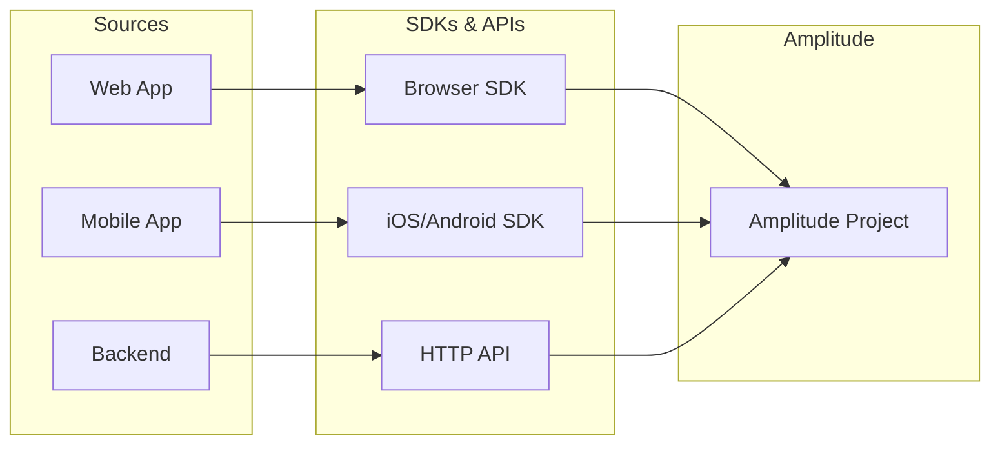

Set up data pipelines and governance for Amplitude. This quickstart covers sending data through the HTTP API, understanding data sources, and setting up exports.

## Before you begin

You need:
- An [Amplitude account](/docs/get-started/create-a-new-account) with admin access to create projects.
- Your project's API key. Find it in *Settings > Projects > [Your Project] > General*.
- A way to make HTTP requests (curl, Postman, or your backend code).

## Step 1: Send events with the HTTP API

Send events directly to Amplitude without an SDK. This is useful for:
- Server-side event tracking.
- Batch imports from your data warehouse.
- Systems where SDKs aren't available.

### Basic HTTP request

```bash
curl -X POST https://api2.amplitude.com/2/httpapi \
  -H "Content-Type: application/json" \
  -d '{
    "api_key": "AMPLITUDE_API_KEY",
    "events": [
      {
        "user_id": "user@example.com",
        "event_type": "Purchase Completed",
        "event_properties": {
          "product_id": "SKU-123",
          "price": 49.99,
          "currency": "USD"
        },
        "user_properties": {
          "plan": "premium",
          "lifetime_value": 499.99
        }
      }
    ]
  }'
```

### Successful response

```json
{
  "code": 200,
  "events_ingested": 1,
  "payload_size_bytes": 285,
  "server_upload_time": 1732147200000
}
```

### Send multiple events

Batch up to 2000 events per request for efficiency:

```bash
curl -X POST https://api2.amplitude.com/2/httpapi \
  -H "Content-Type: application/json" \
  -d '{
    "api_key": "AMPLITUDE_API_KEY",
    "events": [
      {
        "user_id": "user1@example.com",
        "event_type": "Page Viewed",
        "event_properties": {"page": "/pricing"}
      },
      {
        "user_id": "user2@example.com",
        "event_type": "Button Clicked",
        "event_properties": {"button": "Sign Up"}
      }
    ]
  }'
```

## Step 2: Verify data ingestion

Confirm your events arrived in Amplitude.

1. Navigate to *Analytics > User Lookup*.
2. Search for the `user_id` you sent.
3. Check the event stream for your events.

Events typically appear within seconds, but can take up to 2 minutes.

### Debug with the Events page

1. Navigate to *Data > Events*.
2. Search for your event type.
3. Verify the event properties match what you sent.

## Step 3: Understand data sources

Amplitude can ingest data from multiple sources. Choose based on your infrastructure.

| Source type | Best for | Setup complexity |
|-------------|----------|------------------|
| [SDKs](/docs/sdks) | Client-side tracking (web, mobile) | Low |
| [HTTP API](/docs/apis/analytics/http-v2) | Server-side events, batch imports | Low |
| [Warehouse Import](/docs/data/warehouse-native) | Syncing from Snowflake, BigQuery, etc. | Medium |
| [Third-party sources](/docs/data/source-catalog) | Segment, mParticle, Rudderstack | Medium |

### Multi-source architecture

A typical setup combines multiple sources:



## Step 4: Set up data exports

Export Amplitude data to your data warehouse for custom analysis or compliance.

### Available destinations

| Destination | Use case |
|-------------|----------|
| [Amazon S3](/docs/data/destination-catalog/amazon-s3) | Raw event storage, custom processing |
| [Snowflake](/docs/data/destination-catalog/snowflake) | Join with other business data |
| [BigQuery](/docs/data/destination-catalog/bigquery) | Google Cloud analytics |
| [Redshift](/docs/data/destination-catalog/redshift) | AWS analytics |

### Configure an export

1. Navigate to *Data > Destinations*.
2. Click **Add Destination**.
3. Select your destination (for example Snowflake).
4. Enter connection credentials.
5. Choose what to export (events, users, or both).
6. Set the sync frequency.

## Step 5: Plan your data model

Before scaling instrumentation, plan your event taxonomy.

### Event naming conventions

Use consistent naming across your organization:

| Pattern | Example | Notes |
|---------|---------|-------|
| Object Action | `Product Viewed`, `Cart Updated` | Recommended |
| Action Object | `View Product`, `Update Cart` | Also common |
| snake_case | `product_viewed` | Works but harder to read |

**Choose one pattern and stick to it.**

### Required vs optional properties

Define which properties are required for each event:

```json
{
  "event_type": "Purchase Completed",
  "event_properties": {
    "order_id": "required - unique identifier",
    "total": "required - revenue amount",
    "currency": "required - ISO currency code",
    "items": "optional - array of products",
    "coupon_code": "optional - if applied"
  }
}
```

### Use a tracking plan

Document your events in a [tracking plan](/docs/get-started/plan-your-implementation) to ensure consistency across teams.

## Step 6: Set up data governance

Control data quality with Amplitude's governance tools.

### Block unwanted events

Prevent bad data from cluttering your project:

1. Navigate to *Data > Events*.
2. Find the problematic event.
3. Click the menu (⋮) and select **Block**.

Blocked events won't appear in charts but are still stored.

### Transform event names

Fix inconsistent naming without re-instrumenting:

1. Navigate to *Data > Events*.
2. Click the event you want to rename.
3. Use **Display Name** to set a clean name for charts.

### Set up data validation

Use [Ampli](/docs/sdks/ampli) to validate events at development time:
- Generates type-safe tracking code.
- Catches instrumentation errors before production.
- Syncs with your tracking plan.

## What's next?

You've set up the foundation! Here's what to explore next:

| Goal | Resource |
|------|----------|
| HTTP API reference | [HTTP V2 API docs](/docs/apis/analytics/http-v2) |
| Batch import data | [Batch Event Upload API](/docs/apis/analytics/batch-event-upload) |
| Set up warehouse sync | [Warehouse Native](/docs/data/warehouse-native) |
| Browse integrations | [Source Catalog](/docs/data/source-catalog) |
| Create a tracking plan | [Plan your implementation](/docs/get-started/plan-your-implementation) |
| Use type-safe tracking | [Ampli overview](/docs/sdks/ampli) |

## Common issues

### Getting a 400 error

| Error | Cause | Solution |
|-------|-------|----------|
| `Invalid API key` | Wrong or missing API key | Check *Settings > Projects > General* |
| `Invalid event format` | Malformed JSON | Validate JSON syntax |
| `Missing user_id or device_id` | No user identifier | Add `user_id` or `device_id` to each event |

### Events aren't appearing

- **Check the API response:** A 200 response means Amplitude received the data.
- **Wait a few minutes:** Processing can take up to 2 minutes.
- **Verify the project:** Ensure the API key matches the project you're checking.
- **Check blocked events:** Events may be blocked in *Data > Events*.

### High latency in exports

- **Check sync schedule:** Exports run on a schedule, not real-time.
- **Verify credentials:** Connection issues can cause sync failures.
- **Review export logs:** Check *Data > Destinations > [Your Export] > Logs*.

### Duplicate events

Common causes and solutions:
- **Retry logic:** Use `insert_id` to deduplicate events.
- **Multiple SDKs:** Ensure you're not tracking the same event client-side and server-side.
- **Batch import issues:** Use unique identifiers when importing.

```json
{
  "user_id": "user@example.com",
  "event_type": "Purchase Completed",
  "insert_id": "order-12345-purchase",
  "event_properties": {}
}
```

## Related resources

- [HTTP V2 API reference](/docs/apis/analytics/http-v2).
- [Track your progress](/docs/get-started/track-your-progress).
- [Source Catalog](/docs/data/source-catalog).
- [Destination Catalog](/docs/data/destination-catalog).
- [Plan your implementation](/docs/get-started/plan-your-implementation).

